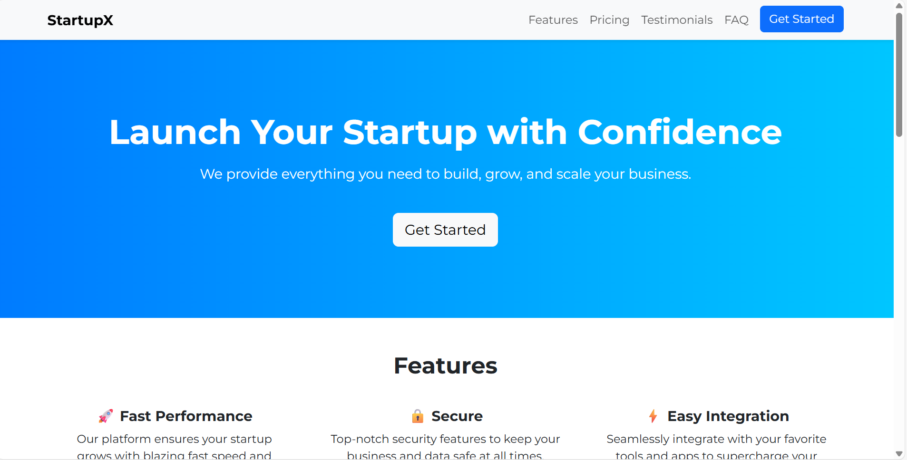

# 🚀 Startup Landing Page

A modern responsive **Startup Landing Page** built with **HTML, CSS, and Bootstrap 5**.

## ✨ Features
- Responsive design for all devices  
- Hero section with CTA  
- Features section with icons  
- Pricing cards  
- Testimonials carousel  
- FAQ accordion  
- Contact form with validation  

## 🛠️ Tech Stack
- HTML5  
- CSS3  
- Bootstrap 5  

## 📸 Screenshot



## 📂 Installation
1. Clone the repo  
   ```bash
   git clone https://github.com/iamvasu18/StartUp-Landing-Page.git
